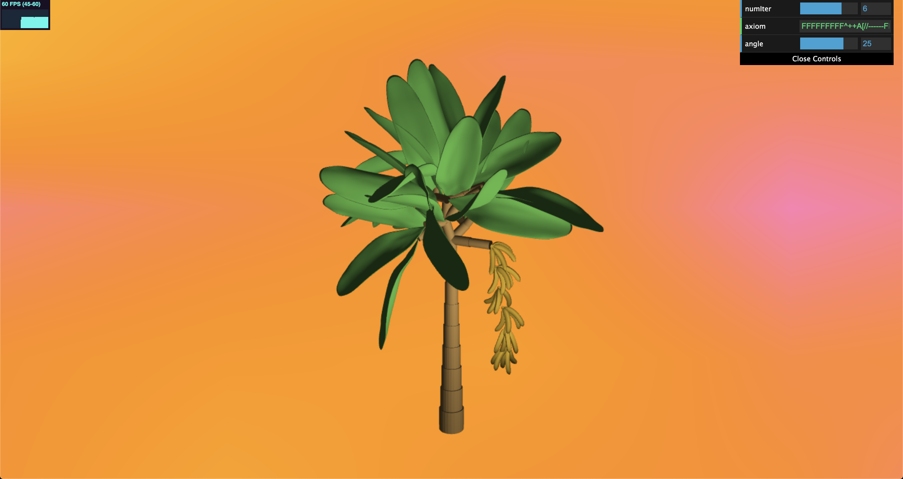
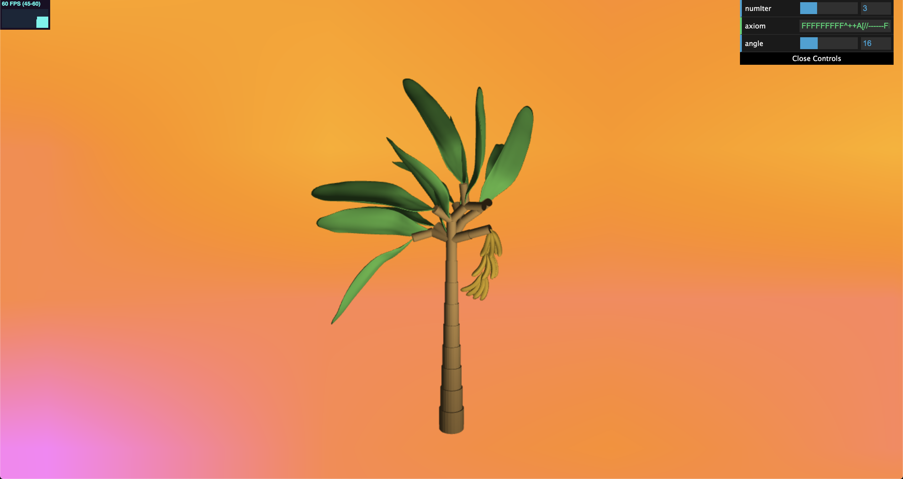
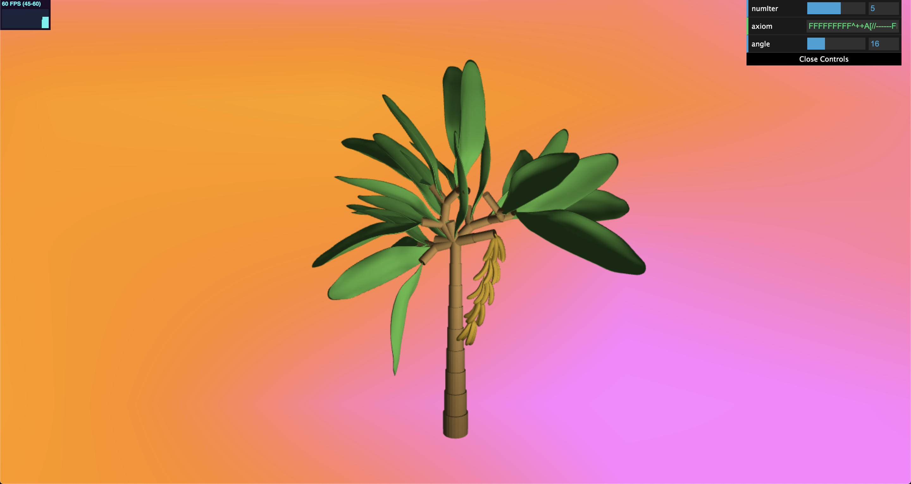
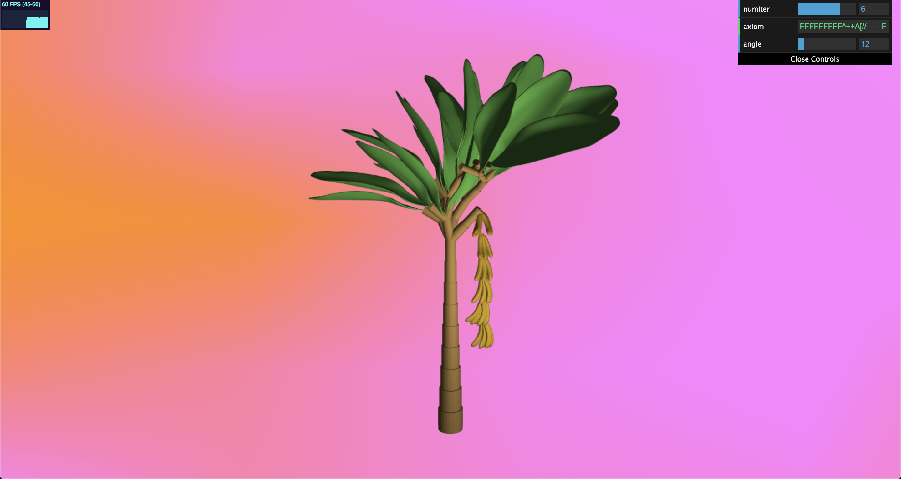

# Homework 4: L-systems

Linda Ting (lstting)

## Demo
The final modeled plant is a banana tree!

6 iterations, 25 degree angle

3 iterations, 16 degree angle

5 iterations, 16 degree angle

6 iterations, 12 degree angle

## L-System 
A series of new classes were created to represent the full system. 

An `Lsystem` class was created to intialize expansion rules and drawing rules, and to take care of expanding and drawing the entire L-system.

The `Turtle` class keeps track of the current position, orientation, branch length, and recursion depth of the expanded grammar.

The `ExpansionRule` class contains a precondition string and a map of probability thresholds to postcondition strings. These rules employ some randomness to ensure the final system is organically formed.

The `DrawingRule` class draws some geometry for a specific symbol in the grammar. 

## User Interface
The user has the ability to control the number of expansion iterations, the starting axiom, and the rotation angle used. 

The background color is generated using FBM noise and a cosine palette.